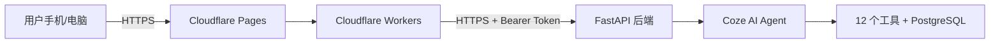

# MathGuide 考研数学智能辅导系统 — 可行性报告

---

## 一、课题名称与成员信息

| 项目 | 内容 |
|------|------|
| 课题名称 | **MathGuide — 考研数学智能辅导系统** |
| 项目类型 | AI + Web 全栈应用 |
| 技术栈 | 前端：React + TypeScript + Vite + Cloudflare Pages |
| | 后端：Python + FastAPI + LangChain |
| | AI：Coze API + doubao-seed-1-8-251228（多模态） |
| | 数据库：PostgreSQL |
| | 部署：Cloudflare Pages + Workers（前端），云端服务器（后端） |

---

## 二、系统概述与设计思路

### 2.1 项目背景

考研数学是硕士研究生入学考试的核心科目，涉及高等数学、线性代数、概率论与数理统计三大模块，知识点多、综合性强，备考难度大。当前市面上的辅导方式存在以下痛点：

| 痛点 | 说明 |
|------|------|
| **批改依赖人工** | 解题练习缺乏即时反馈，手写解答无人批改 |
| **错题管理低效** | 纸质错题本整理繁琐，难以统计分析薄弱点 |
| **复习规划盲目** | 缺乏个性化计划，不清楚各阶段该做什么 |
| **答疑成本高** | 一对一辅导价格昂贵，无法随时提问 |
| **公式查询不便** | 遇到不熟悉的公式需要翻书搜索效率低 |

### 2.2 系统目标

本系统旨在构建一个 **"解题批改 + 错题管理 + 复习规划 + 知识讲解"** 四位一体的考研数学智能辅导平台，以低成本、高可用、易部署为目标，帮助考研学子高效备考。

### 2.3 技术路线



---

## 三、系统架构

### 3.1 总体架构图


### 3.2 前端架构图


### 3.3 数据流图


#### 身份认证流程


---

## 四、核心功能模块

### 4.1 解题批改（analyze_math_image）

```
用户上传题目图片 + 手写解答图片
        ↓
Canvas 压缩至 1024px / 质量 0.6
        ↓
[img]图片URL[/img] 嵌入文本 prompt
        ↓
SSE 流式发送至 Coze Agent
        ↓
Agent 调用 analyze_math_image 工具
        ↓
多模态模型分析 → 步骤级批改
        ↓
返回: 逐步骤判定 + 错误类型 + 评分
        ↓
前端实时渲染: 表格 + ✅/❌ + 评语
```

支持 5 种分析模式：

| 模式 | 用途 |
|------|------|
| `extract_problem` | 提取图片中的题目 |
| `grade_handwriting` | 批改手写解答 |
| `process_grading` | 步骤级判分（考研阅卷标准） |
| `graph_analysis` | 分析函数图像 |
| `ocr_text` | 提取文字 |

### 4.2 错题本管理（error_notebook）

```
4 种操作:
├── add_error: 记录错题（题目/错误答案/正确答案/类型/知识点）
├── list_errors: 查询错题（支持筛选未掌握）
├── get_weak_points: 薄弱点分析（按知识点/错误类型聚合）
└── mark_mastered: 标记为已掌握

数据库: PostgreSQL error_notebook 表
隔离: 按 user_id (SHA256(token)) 隔离
```

### 4.3 复习规划（study_planner）

```
算法流程:
目标分数 → 难度系数 → 各模块目标得分
    ↓
基础阶段: 知识点全覆盖 + 课后习题 (40%)
    ↓
强化阶段: 专题训练 + 题型归纳 (35%)
    ↓
真题阶段: 近15年真题 + 错题回顾 (15%)
    ↓
冲刺阶段: 模拟卷 + 查漏补缺 (10%)

参数: 目标分数 / 每日可用时间 / 数学类型 (一/二/三)
输出: 52周详细计划 + 阶段分布 + 总复习时长
```

### 4.4 艾宾浩斯间隔复习（spaced_review）


---

## 五、仪器设备

| 设备 | 用途 |
|------|------|
| PC机 / Mac | 后端服务部署、前后端开发 |
| 手机 / 平板 | 前端访问、拍照上传题目 |
| 云端服务器 | FastAPI 后端 + PostgreSQL 数据库 |
| Cloudflare CDN | 前端静态托管 + API 代理 |

---

## 六、设计的难点和可能出现的问题

| 难点 | 说明 | 解决方案 |
|------|------|----------|
| **图片识别精度** | 手写数学公式识别准确率受书写质量影响 | doubao-seed 多模态模型 + 图片预处理压缩优化 |
| **流式连接稳定性** | SSE 长连接在网络波动时可能中断 | 前端自动重连 + 断点续传机制 |
| **Token 安全** | API Token 存在浏览器 localStorage 有 XSS 风险 | 仅用于身份认证 + 用户 ID 脱敏 |
| **数据隔离** | 多用户共享数据库需严格隔离 | SHA256(token)[:16] 作为用户 ID，所有查询加 WHERE 条件 |
| **高并发** | 考研冲刺期可能出现并发高峰 | Cloudflare Workers 缓存 + 后端限流 |
| **公式识别歧义** | 不同书写习惯可能导致识别偏差 | 用户可编辑修正 + Agent 多轮确认 |

---

## 七、预期达到的性能指标

| 指标 | 目标 |
|------|------|
| 图片分析响应时间 | ≤ 30 秒（1 张图片） |
| 文本对话首 token 延迟 | ≤ 5 秒 |
| 并发用户数 | ≥ 100 |
| 错题本查询响应 | ≤ 200ms |
| 复习计划生成 | ≤ 10 秒 |
| 页面加载时间 | ≤ 3 秒 (Cloudflare CDN) |
| 系统可用性 | ≥ 99.5% |
| 数据持久性 | PostgreSQL 定期备份 |

---

## 八、前端独立设计部分

### 8.1 数学主题 UI

- **配色**：深蓝灰背景 `#0f1729`，金色 `#f0c060` 强调，米白 `#e8e4db` 文字
- **背景动画**：∑/∫/π/∞/√/Δ 等数学符号低透明度背景粒子
- **加载动画**：∑/∫/∏ 三字符弹跳动画 + 实时计时
- **气泡样式**：金色左边框 + QED 符号 ∎，定理证明风格
- **装饰线**：导航栏下方 —∑—∫—π—∞—√—Δ— 数学符号分割线

### 8.2 渲染引擎

- **LaTeX 公式渲染**：KaTeX，支持 `$...$` `$$...$$` `\(...\)` `\[...\]`
- **Markdown 渲染**：marked，支持表格/标题/代码块/列表
- **工具输出卡片**：错题本/复习计划/函数绘图等结构化展示

### 8.3 多模态输入

- 文字输入 + Shift+Enter 换行
- 多图上传（支持 Ctrl+V 粘贴）
- 文档上传（支持 PDF/DOCX/TXT 等）
- Canvas 压缩至 1024px / 2MB 以内

### 8.4 会话管理

- 多会话侧边栏
- localStorage 持久化消息
- 切换会话自动保存恢复

---

## 九、人员分工与进度安排

### 9.1 人员分工

| 角色 | 职责 |
|------|------|
| 前端开发 | React 组件开发、LaTeX/Markdown 渲染、多图上传、UI/UX |
| 后端开发 | FastAPI 端点、LangChain Agent、12 个工具、数据库 |
| AI 集成 | Coze API 对接、SSE 流式处理、工具调用编排 |
| 运维部署 | Cloudflare Pages + Workers、PostgreSQL 管理、CI/CD |
| 文档撰写 | 可行性报告、用户文档、API 文档 |

### 9.2 进度安排

| 阶段 | 时间 | 内容 |
|------|------|------|
| 需求分析 | 第 1 周 | 竞品调研、功能规划、技术选型 |
| 原型开发 | 第 2-3 周 | 前端骨架 + 后端 API + Coze Agent 搭建 |
| 核心功能 | 第 4-6 周 | 12 个工具开发、SSE 流式对接、图片上传 |
| UI 完善 | 第 7-8 周 | 数学主题 UI、工具输出卡片、Markdown 渲染 |
| 测试优化 | 第 9-10 周 | 图片分析速度优化、会话持久化、错误处理 |
| 部署上线 | 第 11 周 | Cloudflare 部署、域名配置、安全加固 |
| 文档答辩 | 第 12 周 | 撰写报告、准备演示 |

---

## 十、参考文献

1. Coze API 文档 — https://www.coze.cn/docs
2. LangChain 文档 — https://python.langchain.com/docs
3. React 18 官方文档 — https://react.dev
4. KaTeX 公式渲染 — https://katex.org
5. marked Markdown 解析 — https://marked.js.org
6. Cloudflare Pages 文档 — https://developers.cloudflare.com/pages
7. PostgreSQL 文档 — https://www.postgresql.org/docs
8. 考研数学大纲 — 教育部教育考试院
