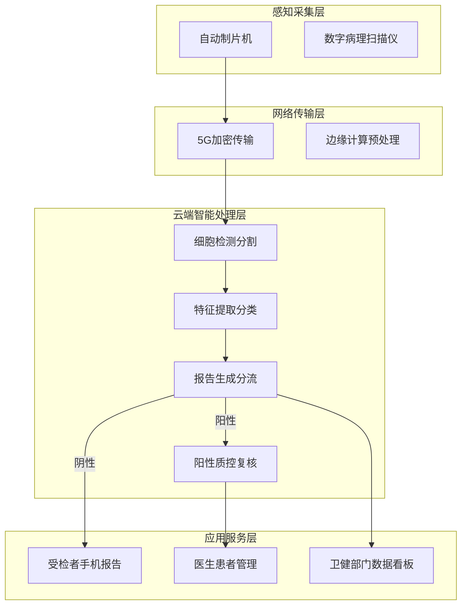
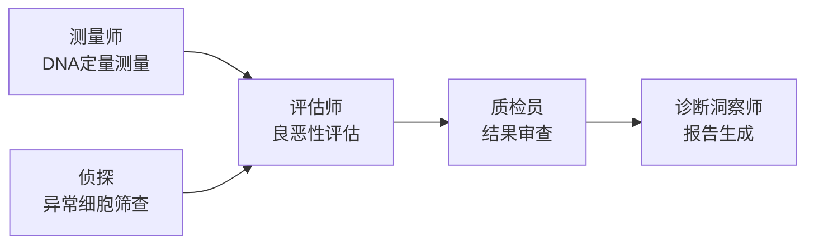
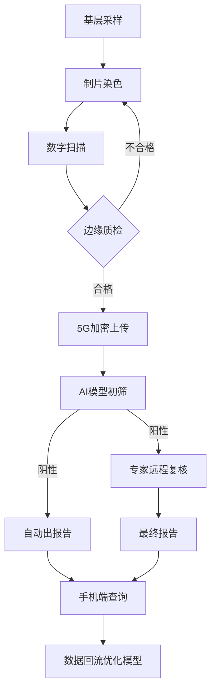

# 基于AIoT的宫颈癌筛查云平台技术方案研究——以武汉兰丁为例

## 摘要

宫颈癌是全球重大公共卫生挑战，我国每年新发病例约15.1万例，基层病理医生严重匮乏导致大规模筛查难以落地。本文以武汉兰丁智能医学股份有限公司为研究对象，系统分析其基于AIoT的肿瘤筛查云平台技术方案。研究表明，该平台通过深度学习病理AI模型、5G云边协同架构及人机协同质控机制，构建了"终端采样—云端诊断—远程复核—报告直达"的全链条体系，已累计完成超1300万人次筛查。基于该平台的AI辅助液基细胞学检查对CIN2+的敏感性达74.1%、特异性达95.6%，每5年筛查一次是最具成本效益的策略。本文重点分析了平台的核心关键技术与应用前景，并探讨其现存不足与对策。

**关键词**：AIoT；宫颈癌筛查；云平台；深度学习；成本效益；武汉兰丁

## 1 引言

宫颈癌是全球第四大女性癌症死因，2020年全球约60.4万新发病例和34.2万死亡病例[1]。WHO于2020年发布《加速消除宫颈癌全球战略》，提出2030年实现"90–70–90"阶段性目标，即90%的女孩在15岁前完成HPV疫苗接种、70%的女性在35岁和45岁前各接受一次高效筛查、90%的确诊患者得到规范治疗[1]。2022年我国宫颈癌新发病例约15.1万例，死亡约5.6万例，发病率13.8/10万，且农村发病率显著高于城市，发病呈年轻化趋势[2]。然而传统筛查依赖病理医生显微镜下逐张阅片，我国注册病理医生仅9000余人，缺口高达9万，培养一名成熟病理医生需8—10年，适龄妇女中仅约1/5在3年内接受过筛查，远低于WHO 70%的目标[3]。

人工智能物联网（AIoT）将AI的感知与决策能力与IoT的广泛连接能力深度融合，可实现"终端采集—云端分析—结果反馈"的端到端智能化闭环。武汉兰丁智能医学股份有限公司自主研发的"基于AIoT的肿瘤筛查云平台"，基于千万级临床样本训练的深度学习模型，实现宫颈细胞学的云端AI诊断。Shen等[3]基于湖北省70万女性筛查数据的卫生经济学评价表明，基于兰丁CytoScanner的AI辅助液基细胞学检查（AI-assisted LBC）每5年筛查一次是最具成本效益的策略，增量成本效果比（ICER）为8790美元/QALY。截至2025年，该平台已覆盖全国31个省市、超2000家医疗机构，累计完成超1300万人次筛查，被世界经济论坛评选为"全球性人工智能标杆项目"[4]。本文将从技术路线、关键技术和应用前景三个维度对该平台进行深入分析。

## 2 研究内容与技术路线

### 2.1 问题界定与总体设计

当前核心矛盾在于数亿适龄妇女的筛查需求与有限医疗资源之间的失衡。传统模式下，一名病理医生日均处理约100张玻片，全国年筛查通量上限不足5000万例。兰丁AIoT云平台以"AI即服务"为核心理念，构建了"采样数据化→传输云端化→诊断智能化→复核人性化"的闭环系统[5]。平台涵盖四大模块：**基层采样数字化模块**配备自动制片机和高通量扫描仪，将玻片转化为全切片数字图像（WSI），每张切片生成数GB级高清图像；**云端AI诊断引擎模块**由CytoBrain引擎自动完成细胞分割、特征提取与分类判别，初筛分流约80%—90%的阴性样本[5]；**远程专家复核模块**对阳性及抽查阴性样本进行云端质控；**大数据管理模块**为卫健部门提供区域筛查数据可视化看板。

### 2.2 系统架构

平台采用经典的"云—管—端"分层架构，自下而上分为四层：

**图1 系统总体架构图**

**感知采集层**将宫颈细胞玻片转化为WSI数字图像，单张切片生成数GB级高清图像，分辨率达0.25 μm/pixel，满足细胞核形态学分析精度要求，是IoT"感知"功能的集中体现[6]。**网络传输层**通过5G大带宽（峰值10—20 Gbps）和低延迟（端到端<10 ms）保障大规模数字图像实时传输[7]；边缘计算节点完成图像压缩和质检，剔除不合格图像后加密上传，延迟可控制在200 ms以内。**云端智能处理层**部署CytoBrain引擎，基于分布式GPU集群实现大规模并行推理，依次完成细胞检测分割、特征提取分类和报告生成分流。**应用服务层**面向受检者（手机端7天内查询报告）、基层医生（从阅片解放、聚焦患者管理）和卫生管理部门（数据看板实时监控区域筛查进展）提供差异化输出。

## 3 关键技术

### 3.1 基于深度学习的宫颈细胞图像分析算法

深度学习算法是平台的核心引擎。宫颈细胞病理AI分析经历从CNN单细胞分类到Transformer全切片级方案的演进。兰丁CytoBrain引擎采用CNN与Vision Transformer混合架构：CNN分支捕捉局部细胞形态细节（如细胞核边缘、染色质纹理），Transformer分支建模细胞间空间关系和全局组织上下文，二者互补形成多尺度特征表示。

第五代"兰丁思邈"大模型（15亿参数）引入多智能体架构，设置五个智能体协同工作[5]：

**图2 兰丁思邈五脑多智能体架构**

**测量师**精确测量细胞核DNA含量等参数；**侦探**在数亿细胞中锁定异常细胞；**评估师**进行良恶性综合评估；**质检员**对结果进行质量审查；**诊断洞察师**利用生成式AI生成多模态报告。

据Shen等[3]基于湖北省70万女性筛查数据的研究，AI-assisted LBC检出CIN2+的敏感性为74.1%（95%CI: 63.5%–83.6%），特异性为95.6%（95%CI: 94.6%–96.6%），相对人工LBC敏感性提高5.8%。该研究还构建了Markov模型对10万例30岁女性进行终生模拟，发现AI-assisted LBC每5年筛查一次的ICER为8790美元/QALY，在3倍人均GDP阈值下具有55.4%的成本效益概率。训练数据方面，兰丁模型基于全球最大宫颈癌AI数字病理数据库，累计超1300万例宫颈样本，有效细胞标注超10亿张，总数据量超1400TB。模型在像素级完成细胞核分割后，自动测量DNA倍体含量、核质比、染色质分布等数十项量化指标，将病理医生的经验判断转化为可计算的特征向量，体现了AI"标准化、可复制"的核心优势。学术界同类研究也验证了CNN-Transformer混合路线的有效性：基于Cell Comparative Learning的方法在2177张WSI上实现0.9319的AUC，达到病理医生级别[8]；混合模型在宫颈细胞学数据集上准确率达95%—99%[9]。兰丁在湖北省616万例筛查中阳性检出率达5.6%，高于传统人工模式的约3%[10]。

**数据飞轮效应**：平台每完成一例筛查，AI诊断经专家复核后的反馈数据都会重新汇入训练集，持续优化模型性能。这种"数据越多、模型越准、用户越多、数据越多"的正反馈循环，使数据成为核心资产和竞争壁垒。Shen等[3]指出，随着技术持续进步和临床数据不断积累，AI诊断系统的准确性、效率和卫生经济学效益有望进一步提升，对大规模人群筛查具有重要意义。

### 3.2 高通量切片扫描与5G云边协同架构

兰丁数字病理扫描仪集成物联网芯片，可实时在线并与云端保持通信。设备支持20×和40×双物镜，单台日处理数百张玻片，采用自动对焦和多层融合技术保证高放大倍率下图像清晰度。边缘计算节点在端侧完成图像压缩和质量检查后，剔除制片不合格的无效图像，再通过5G网络上传至云端。相比4G，5G传输时间缩短约10倍，超低延迟使远程专家可实时调阅复核[7]。该架构实现了"终端轻量化、云端智能化"的AIoT设计理念。整个筛查诊断流程如图3所示。

**图3 AI宫颈癌筛查诊断流程图**

### 3.3 人机协同的闭环质控

平台设计了三层闭环质控机制：AI对所有样本初筛，阴性样本自动生成报告并返回受检者；阳性样本及5%—10%阴性抽查样本推送平台注册的病理专家进行远程人工复核。复核结果与AI初筛不一致时，系统自动记录该样本进入训练集，用于模型定向优化。这一滚雪球式质控机制实现了效率与精度的平衡：AI承担80%—90%的阴性样本筛选工作，将专家精力集中在关键判读上，使专家日处理效率提升约100倍，检验成本降低约100倍[10]。

从产品迭代角度看，兰丁从宫颈癌单病种切入，积累数据和模型能力后逐步扩展至口腔癌、甲状腺癌、乳腺癌等十余种肿瘤。2025年启动的"千县行动"计划为全国1000个县级妇幼保健院定制AI筛查云实验室，体现了"单点突破、横向复制、纵向优化"的互联网产品迭代思维。

## 4 应用前景分析

### 4.1 市场与社会双驱动

国家从2009年起启动"两癌"免费筛查，截至2024年累计免费筛查2.8亿人次，覆盖全国2765个县（市、区），检出宫颈癌及癌前病变患者90.2万例[2]。2023年国家卫健委等10部门联合启动"加速消除宫颈癌"行动计划。在这一政策背景下，大规模、高效率、低成本的AIoT筛查方案具有明确的社会需求和广阔市场空间。Shen等[3]的卫生经济学评价表明，基于兰丁系统的AI-assisted LBC每5年筛查一次最具成本效益，ICER为8,790美元/QALY，在3倍人均GDP阈值下具有55.4%的成本效益概率，优于人工LBC策略。其单次筛查成本随规模扩大而显著降低：10万例规模时仅需5.1美元/例，远低于人工LBC的9.5美元和HPV DNA检测的10.8美元；即便降至1万例规模，成本也仅为10.7美元/例，仍具价格竞争力。表1对比了关键指标。

**表1 传统筛查与AIoT筛查模式关键指标对比**

| 对比维度 | 传统人工模式 | 兰丁AIoT平台模式 |
|---------|-------------|-----------------|
| CIN2+检出敏感性 | 约70% | 74.1%[3] |
| 特异性 | 约96% | 95.6%[3] |
| 单例筛查成本（10万规模） | $9.5（人工LBC） | $5.1 |
| 日检测通量 | ≈100张/人 | 50,000张/天 |
| 阳性检出率 | 约3% | 5.6% |
| 覆盖范围 | 大中型医院 | 全国2000+机构 |

### 4.2 重点应用场景

**农村与边疆地区**：AIoT平台的最大价值在于赋能医疗资源薄弱地区。兰丁推出"移动筛查车"方案（如图4所示），将制片和扫描设备集成于移动车辆，深入偏远乡村现场采样和数字化，通过5G实时上传云端诊断，有效解决了农村地区"最后一公里"的筛查瓶颈。

**图4 兰丁5G+AI宫颈癌筛查车深入基层社区**

**职工体检与商业保险**：将AI宫颈癌筛查作为高附加值体检项目纳入职工套餐，可提升早期发现率，同时为保险公司提供精算数据。兰丁AI云诊断实验室（如图5所示）的高通量处理能力可以支持大规模体检需求，形成"筛查—保险—健康管理"的商业闭环。

**图5 兰丁AI云诊断实验室工作场景**

**"一带一路"国际输出**：兰丁已与印度尼西亚、巴基斯坦、巴西、肯尼亚、摩洛哥等近20国合作建立AI数字病理实验室（如图6所示）[4]。Shen等[3]指出，对于同样面临病理医生短缺的其他发展中国家，AI辅助细胞学筛查是一种可行且可快速推广的解决方案。

**图6 兰丁AI宫颈癌筛查技术"一带一路"国际合作**

### 4.3 平台商业模式

平台采用**SaaS模式**按筛查例数收费，基层医疗机构无需一次性投入巨额资金建设病理科，极大地降低了技术使用门槛。这一模式契合了"低成本、广覆盖"的公共卫生需求。单例成本随筛查规模扩大而显著下降，从1万例时的10.7美元降至10万例时的5.1美元[3]，体现了互联网平台的规模经济效应。湖北省2022—2024年投入5.95亿元完成616万例AI筛查，每例仅约96元，而传统人工模式同等规模成本高出数十倍[2]。同时，平台连接设备供应商、耗材商、AI技术服务商、病理专家、医疗机构和卫健部门多边主体，形成"筛查服务—数据分析—政策决策—健康管理"的价值闭环，是AIoT赋能医疗产业升级的典型范例。

## 5 存在不足与对策

### 5.1 AI模型可解释性不足

深度学习"黑箱"问题在医疗诊断中尤为敏感——临床医生需要理解AI"为什么"得出结论。兰丁思邈已引入透明化推理机制，将诊断逻辑拆分为可追溯过程[5]。**对策**：引入Grad-CAM等可视化技术[11]标注可疑区域细胞级热力图，同时建立AI病理诊断行业金标准。

### 5.2 数据隐私风险

中心化云架构使患者敏感数据面临泄露和合规挑战[12]。**对策**：引入联邦学习框架[13]，实现"数据不动模型动"，仅上传加密梯度参数，通过差分隐私技术防止参数反推原始数据。

### 5.3 复杂场景漏诊

制片不满意、细胞团重叠或罕见病变场景下存在漏诊风险。Shen等[3]指出，实际临床环境中AI敏感性和特异性可能低于受控环境测量值。**对策**：质量不合格样本强制转交人工复核，设置"机器不可决"的兜底机制；新癌种通过与三甲医院合作共建专病数据库攻克样本门槛。

## 6 结论

本文以武汉兰丁为案例，系统分析了基于AIoT的宫颈癌筛查云平台技术方案。该平台通过CNN-ViT混合架构病理AI模型（兰丁思邈五脑多智能体）、5G云边协同架构（边缘预处理、大带宽低延迟传输）和人机闭环质控机制，构建了"终端采样—云端诊断—远程复核—报告直达"的全链条智能化筛查体系。Shen等[3]发表于The Lancet Regional Health的权威研究验证了基于该平台的AI-assisted LBC筛查每5年一次最具成本效益（ICER=8,790美元/QALY），显著优于人工LBC策略。在湖北616万例大规模实践中取得了阳性检出率5.6%、特异性95.6%的成效。

该方案证明AIoT技术在实现宫颈癌大规模筛查的"可及性"与"可负担性"方面具有显著优势。随着5G/6G通信、边缘智能、多模态AI等技术的持续进步，AIoT有望推动智慧医疗从"单点疾病筛查"走向"全周期健康管理"，从"专科突破"走向"全民普惠"。

## 参考文献

[1] World Health Organization. Global strategy to accelerate the elimination of cervical cancer as a public health problem[M]. Geneva: WHO, 2020.
[2] 国家卫生健康委员会. 推动加速消除宫颈癌有关情况新闻发布会文字实录[EB/OL]. 2024.
[3] Shen M, Zou Z, Bao H, et al. Cost-effectiveness of artificial intelligence-assisted liquid-based cytology testing for cervical cancer screening in China[J]. The Lancet Regional Health - Western Pacific, 2023, 34: 100726.
[4] 世界经济论坛. 兰丁入选世界经济论坛全球AI标杆项目[EB/OL]. 2025.
[5] 兰丁智能医学. "兰丁思邈"AI病理诊断大模型发布[EB/OL]. 2025a.
[6] Atupelage C, Nagahashi H, Kimura F. Digital pathology, deep learning, and cancer: A narrative review[J]. Cold Spring Harbor Laboratory, 2024.
[7] Wang L, Chen Y, Zhao H. Telemedicine and 5G technologies: A systematic global review[J]. Bioengineering, 2024, 13(4): 438.
[8] Qin J, Wang Y, Li Z. Cell comparative learning: A cervical cytopathology whole slide image classification method[J]. Computerized Medical Imaging and Graphics, 2024, 108: 102398.
[9] Muksimova S, Umirzakova S, Cho Y I. RL-CancerNet for cervical cancer[J]. Cancers, 2024, 16(22): 3782.
[10] 长江日报. 兰丁数智化创新驱动"第二增长曲线"[N]. 长江日报, 2025-01-20.
[11] Selvaraju R R, Cogswell M, Das A, et al. Grad-CAM: Visual explanations from deep networks via gradient-based localization[C]//Proc. of ICCV, 2017: 618-626.
[12] Hernández-Cruz N, et al. Review of federated learning for medical image analysis[J]. Big Data and Cognitive Computing, 2024, 8(9): 99.
[13] Koutsoubis N, et al. Privacy preserving federated learning in medical imaging[J]. arXiv preprint, 2024, arXiv:2406.12815.
